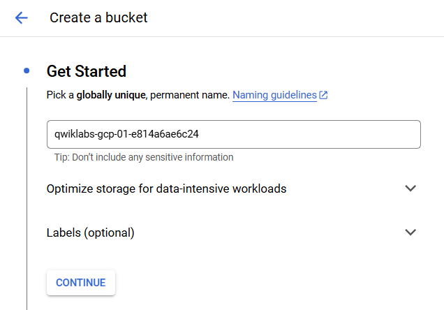
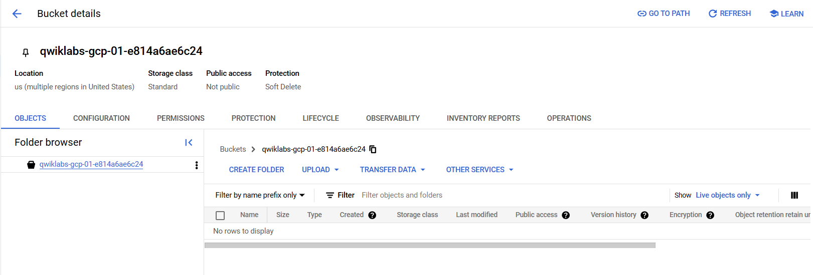

# Working with the Google Cloud Console and Cloud Shell

### 1. Use the Cloud Console to create a bucket

1. In the Cloud Console, on the Navigation menu (Navigation menu), click Cloud Storage > Buckets.

2. Click Create.

3. For Name, type a globally unique bucket name; leave all other values as their defaults.

4. Click Create.



5. If prompted Public access will be prevented click Confirm.



### 2. Use Cloud Shell to create a Cloud Storage bucket

1. Open Cloud Shell.

2. Use the gcloud storage command to create another bucket. Replace [BUCKET_NAME] with a globally unique name (you can append a 2 to the globally unique bucket name you used previously):

```bash
gcloud storage buckets create gs://[BUCKET_NAME]
```

3. If prompted, click Authorize.

4. In the Cloud Console, on the Navigation menu, click Cloud Storage > Buckets, or click Refresh if you are already in the Storage browser. The second bucket should be displayed in the Buckets list.

> Note: You have performed equivalent actions using the Cloud Console and Cloud Shell. You created a bucket using the Cloud Console and another bucket using Cloud Shell.

### 3. Upload a file

1. Open Cloud Shell.

2. Click the More button (More button) in the Cloud Shell toolbar to display further options.

3. Click Upload. Upload any file from your local machine to the Cloud Shell VM. This file will be referred to as [MY_FILE].

4. In Cloud Shell, type ls to confirm that the file was uploaded.

5. Copy the file into one of the buckets you created earlier in the lab. Replace [MY_FILE] with the file you uploaded and [BUCKET_NAME] with one of your bucket names:

```bash
gcloud storage cp [MY_FILE] gs://[BUCKET_NAME]
```

If your filename has whitespaces, be sure to place single quotes around the filename. For example, gcloud storage cp ‘my file.txt' gs://[BUCKET_NAME]

> Note: You have uploaded a file to the Cloud Shell VM and copied it to a bucket.

### 4. Create a persistent state in Cloud Shell

#### Create and verify an environment variable

1. Create an environment variable and replace [YOUR_REGION] with the region you selected in the previous step:

```bash
INFRACLASS_REGION=[YOUR_REGION]
```

2. Verify it with echo:

```bash
echo $INFRACLASS_REGION
```

#### Append the environment variable to a file

1. Create a subdirectory for materials used in this lab:

```bash
mkdir infraclass
```

2. Create a file called config in the infraclass directory:

```bash
touch infraclass/config
```

3. Append the value of your Region environment variable to the config file:

```bash
echo INFRACLASS_REGION=$INFRACLASS_REGION >> ~/infraclass/config
```

4. Create a second environment variable for your Project ID, replacing [YOUR_PROJECT_ID] with your Project ID. You can find the project ID on the Cloud Console Home page.

```bash
INFRACLASS_PROJECT_ID=[YOUR_PROJECT_ID]
```

5. Append the value of your Project ID environment variable to the config file:

```bash
echo INFRACLASS_PROJECT_ID=$INFRACLASS_PROJECT_ID >> ~/infraclass/config
```

6. Use the source command to set the environment variables, and use the echo command to verify that the project variable was set:

```bash
source infraclass/config
echo $INFRACLASS_PROJECT_ID
```

7. Close and re-open Cloud Shell. Then issue the echo command again:

```bash
echo $INFRACLASS_PROJECT_ID
```

8. There will be no output because the environment variable no longer exists.

#### Modify the bash profile and create persistence

1. Edit the shell profile with the following command:

```bash
nano .profile
```

2. Add the following line to the end of the file:

```bash
source infraclass/config
```

3. Press Ctrl+O, ENTER to save the file, and then press Ctrl+X to exit nano.
4. Close and then re-open Cloud Shell to reset the VM.
5. Use the echo command to verify that the variable is still set:

```bash
echo $INFRACLASS_PROJECT_ID
```

You should now see the expected value that you set in the config file.
