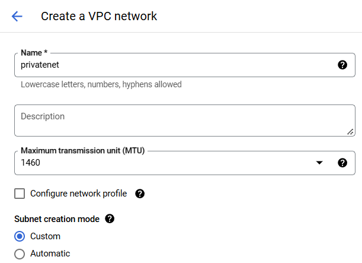
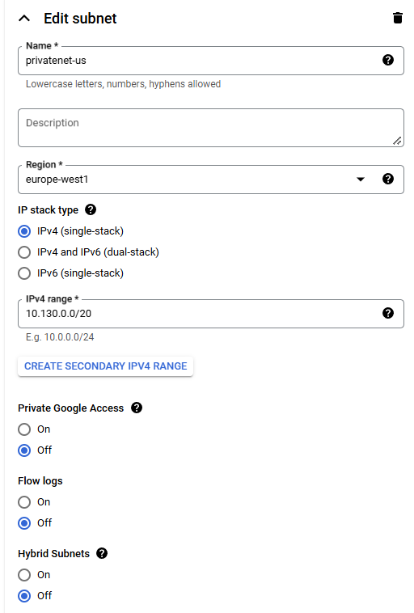
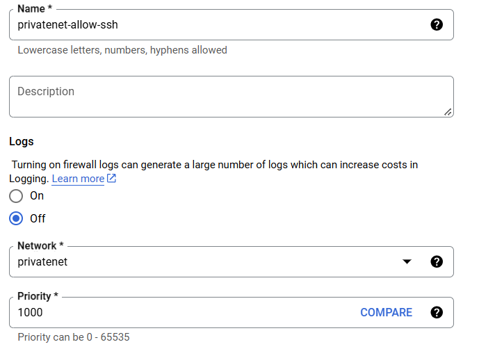
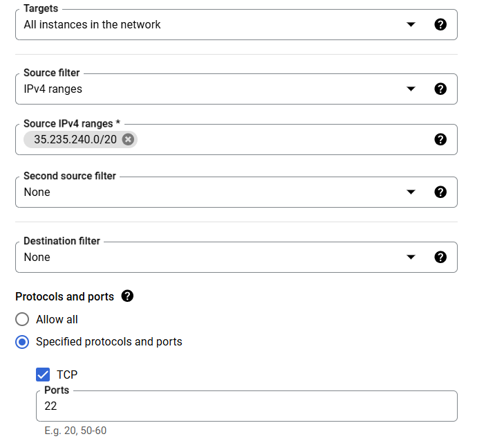
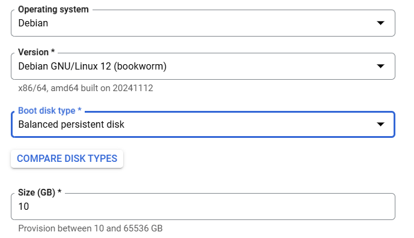

# Implement Private Google Access and Cloud NAT

### 1. Create a VPC network and firewall rules

1. In the Cloud Console, on the Navigation menu (Navigation menu icon), click VPC network > VPC networks.

2. Click Create VPC Network.

3. For Name, type privatenet.

4. For Subnet creation mode, click Custom.



5. In New Subnet specify the following, and leave the remaining settings as their defaults:

| Property   | Value         |
| ---------- | ------------- |
| Name       | privatenet-us |
| Region     | name_region   |
| IPv4 range | 10.130.0.0/20 |

> Note: Don't enable Private Google access yet!



6. Click Done.

7. Click Create.

8. In the left pane, click Firewall.

9. Click Create Firewall Rule.

10. Specify the following, and leave the remaining settings as their defaults:

| Property            | Value                         |
| ------------------- | ----------------------------- |
| Name                | privatenet-allow-ssh          |
| Network             | privatenet                    |
| Targets             | All instances in the network  |
| Source filter       | IPv4 Ranges                   |
| Source IPv4 ranges  | 35.235.240.0/20               |
| Protocols and ports | Specified protocols and ports |

11. For tcp, click the checkbox and specify port 22.





12. Click Create.

> Note: In order to connect to your private instance using SSH, you need to open an appropriate port on the firewall. [IAP connections](https://cloud.google.com/iap/docs/using-tcp-forwarding?hl=id) come from a specific set of IP addresses (35.235.240.0/20). Therefore, you can limit the rule to this CIDR range.

### 2. Create the VM instance with no public IP address

1. In the Cloud Console, on the Navigation menu, click Compute Engine > VM instances.

2. Click Create Instance.

3. Specify the following, and leave the remaining settings as their defaults:

| Property     | Value                                  |
| ------------ | -------------------------------------- |
| Name         | vm-internal                            |
| Region       | region_name                            |
| Zone         | zone_name                              |
| Series       | E2                                     |
| Machine type | e2-medium (2vCPU, 1 core, 4 GB memory) |
| Boot disk    | Debian GNU/Linux 12 (bookworm)         |




4. Click Advanced options.

5. Click Networking.

6. In Network interfaces, click the default network to edit it.

7. Specify the following, and leave the remaining settings as their defaults:

| Property              | Value       |
| --------------------- | ----------- |
| Network               | vpc_name    |
| Subnetwork            | subnet_name |
| External IPv4 address | None        |

8. Click Done.

9. Click Create.

10. On the VM instances page, verify that the External IP of vm-internal is None.

### 3. SSH to vm-internal to test the IAP tunnel

1. In the Cloud Console, click Activate Cloud Shell (Cloud Shell).

2. If prompted, click Continue.

3. To connect to vm-internal, run the following command:

```bash
gcloud compute ssh vm-internal --zone ZONE --tunnel-through-iap
```

4. If prompted click Authorize

5. If prompted to continue, type Y.

6. When prompted for a passphrase, press ENTER.

7. When prompted for the same passphrase, press ENTER.

8. To test the external connectivity of vm-internal, run the following command:

```bash
ping -c 2 www.google.com
```

This should not work because vm-internal has no external IP address!

9. Wait for the ping command to complete.

10. To return to your Cloud Shell instance, run the following command:

```bash
exit
```

> Note: When instances do not have external IP addresses, they can only be reached by other instances on the network via a managed VPN gateway or via a Cloud IAP tunnel. Cloud IAP enables context-aware access to VMs via SSH and RDP without bastion hosts. To learn more about this, see the blog post [Cloud IAP enables context-aware access to VMs via SSH and RDP without bastion hosts](https://cloud.google.com/blog/products/identity-security/cloud-iap-enables-context-aware-access-to-vms-via-ssh-and-rdp-without-bastion-hosts).

### 4. Enable Private Google Access

1. In the Cloud Console, on the Navigation menu (Navigation menu icon), click VPC network > VPC networks.

2. Click privatenet to open the network.

3. Click Subnets, and then click privatenet-us.

4. Click Edit.

5. For Private Google access, select On.

6. Click Save.

### 5. Configure a Cloud NAT gateway

Although vm-internal can now access certain Google APIs and services without an external IP address, the instance cannot access the internet for updates and patches. Configure a Cloud NAT gateway, which allows vm-internal to reach the internet.

1. On the Google Cloud console title bar, type Network services in the Search field, then click Network services in the Products & Page section.

2. On the Network service page, click Pin next to Network services.

3. Click Cloud NAT.

4. Click Get started to configure a NAT gateway.

5. Specify the following:

| Property     | Value       |
| ------------ | ----------- |
| Gateway name | nat-config  |
| Network      | privatenet  |
| Region       | region_name |

6. For Cloud Router, select Create new router.

7. For Name, type nat-router

8. Click Create.

9. Click Create.

10. Wait for the gateway's status to change to Running.

### 6. Configure and view logs with Cloud NAT Logging

Enabling logging

1. In the Google Cloud Console, on the Navigation menu (Navigation menu icon), click Network services > Cloud NAT.

2. Click on the nat-config gateway and then click Edit.

3. Click the Advanced configurations dropdown to open that section.

4. For Logging, select Translation and errors and then click Save.

NAT logging in Cloud Logging

1. Click on nat-config to expose its details. Then click on the View in Logs Explorer.

2. This will open a new tab with Logs Explorer.
