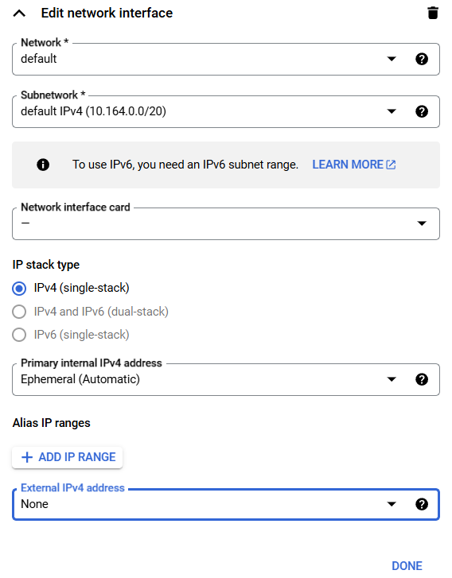
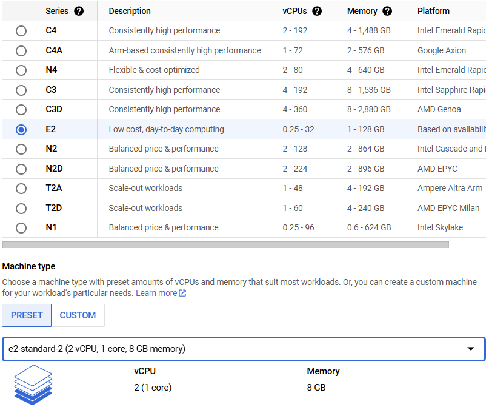
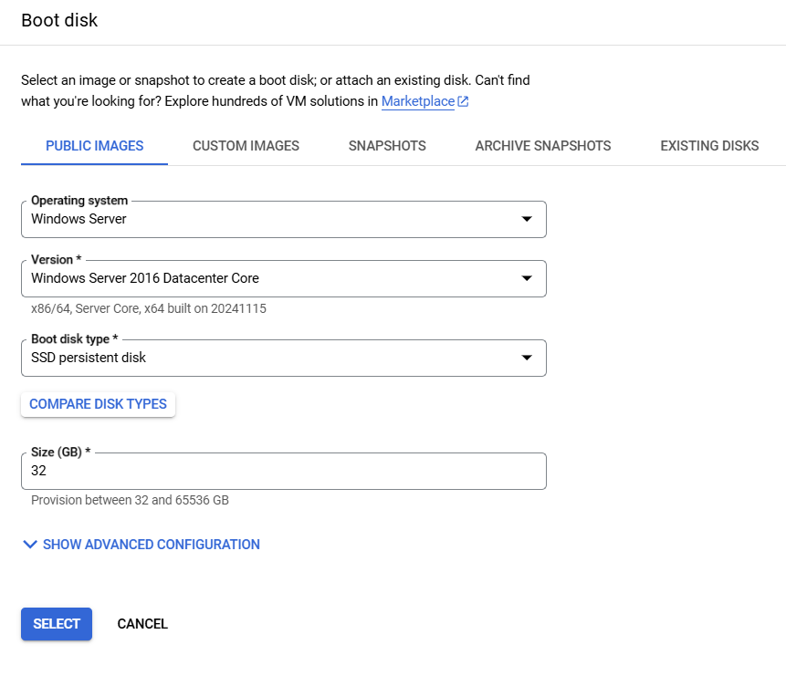
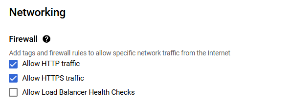
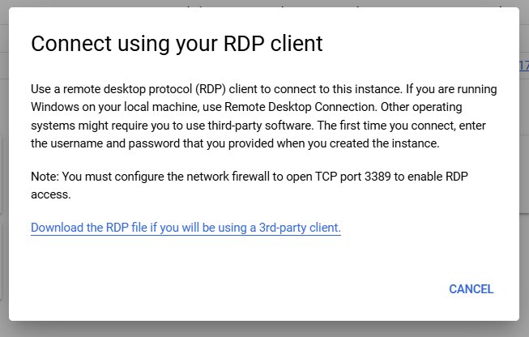
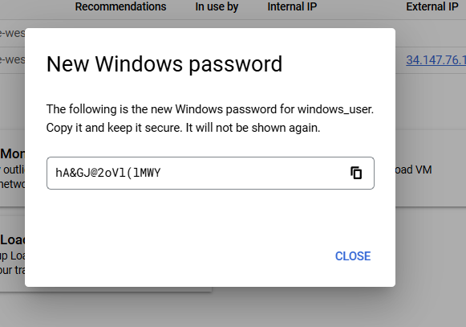
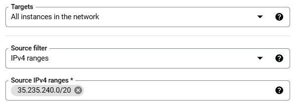
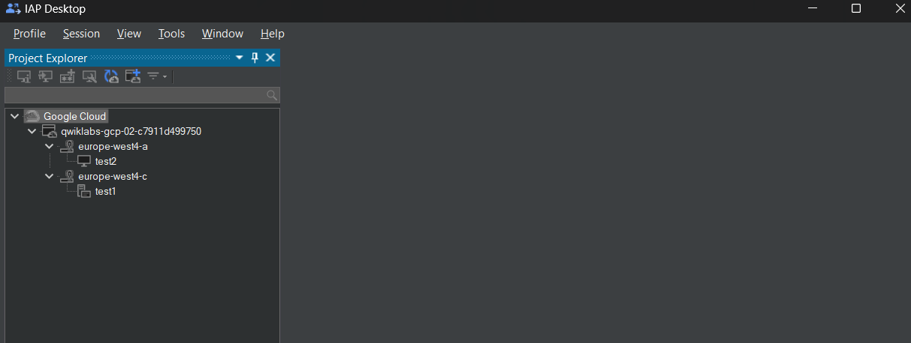

# Creating Virtual Machines

### 1. Create a utility virtual machine

1. In the Cloud Console, on the Navigation menu, click Compute Engine > VM instances.

2. Click Create Instance.

3. For Name, type a name for your instance. Hover over the question mark icon

4. for advice about what constitutes a properly formed name.

5. For Region and Zone select `region_name` and `zone_name` respectively.

6. For Machine configuration, select Series as E2.

7. For Machine type, examine the options.

8. Click Details to the right of the Machine type list to see the breakdown of estimated costs.

9. For Machine type, click e2-standard-4 (4 vCPUs, 16 GB memory). How did the cost change?

10. For Machine type, click e2-medium (2 vCPUs, 4 GB memory).

11. Click Advanced options.

12. Click Networking.

13. For Network interfaces, click the dropdown icon.

14. Select None for External IPv4 address.

15. Click Done.

16. Leave the remaining settings as their defaults, and click Create. Wait until the new VM is created.

### 2. Create a Windows virtual machine

1. On the Navigation menu (Navigation menu icon), click Compute Engine > VM instances.

2. Click Create instance.

3. Specify the following, and leave the remaining settings as their defaults:

| Property       | Value                               |
| -------------- | ----------------------------------- |
| Name           | Type a name for your VM             |
| Region         | region_name                         |
| Zone           | zone_name                           |
| Series         | E2                                  |
| Machine type   | e2-standard-2(2 vCPUs, 8 GB memory) |
| Boot disk      | Windows Server 2016 Datacenter Core |
| Boot disk type | SSD persistent disk                 |

4. Click Select.

5. For Firewall, enable Allow HTTP traffic and Allow HTTPS traffic.

6. Click Create.

> Note: Installing an RDP client on your local machine is outside the scope of this lab and of the class. For this reason, you will not be connecting to the Windows VM during this lab. However, you will step through the usual procedures up to the point of requiring the RDP client. Instructions for connecting to Windows VMs are in the [Connecting to Windows VMs Guide](https://cloud.google.com/compute/docs/instances/connecting-to-windows?hl=id).

Set the password for the VM

1. Click on the name of your Windows VM to access the VM instance details.

2. You don't have a valid password for this Windows VM: you cannot log in to the Windows VM without a password. Click Set Windows password.

3. Click Set.

4. Copy the provided password, and click CLOSE.

> Note: You will not connect to the Windows VM during this lab. However, the process would look something like the following (depending on the RDP client you installed). The RDP client shown can be installed for Chrome from the [Chrome webstore](https://chromewebstore.google.com/detail/chrome-rdp-for-google-clo/mpbbnannobiobpnfblimoapbephgifkm?hl=en-US). On the VM instances page, you would click RDP for your Windows VM and connect with the password copied earlier.

Before connecting using Desktop IAP, ensure the following prerequisites are met:

- You have configured the VPC to [allow IAP traffic to the VM instance](https://cloud.google.com/iap/docs/using-tcp-forwarding?hl=id#create-firewall-rule).
- You have downloaded and installed [IAP Desktop on your local computer](https://googlecloudplatform.github.io/iap-desktop/?utm_source=cloud.google.com).

To connect to a VM instance using Desktop IAP, perform the following steps:

- In IAP Desktop, select Profile > Add project .

- Enter your project ID or name, then click OK .

- In the Project Explorer window , right-click the VM instance you want to connect to, and then select Connect

