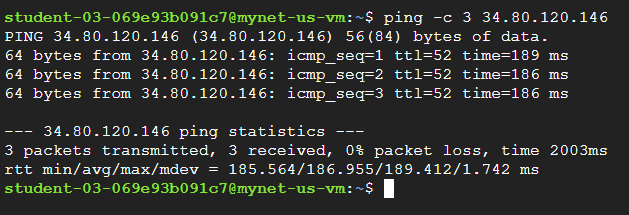

# VPC Networking and Google Compute Engine

### 1. Create a VPC network and VM instances

#### Create an auto mode VPC network with Firewall rules

1. On the Navigation menu (Navigation menu icon), click VPC network > VPC networks.

2. Click Create VPC network.

3. For Name, type mynetwork.

4. For Subnet creation mode, click Automatic. Auto mode networks create subnets in each region automatically.

5. For Firewall, select all available rules.
   These are the same standard firewall rules that the default network had. The deny-all-ingress and allow-all-egress rules are also displayed, but you cannot check or uncheck them because they are implied. These two rules have a lower Priority (higher integers indicate lower priorities) so that the allow ICMP, custom, RDP and SSH rules are considered first.

6. Click Create.
   When the new network is ready, notice that a subnet was created for each region.

7. Explore the IP address range for the subnets in Region 1 and Region 2.


> **Note**: If you ever delete the default network, you can quickly re-create it by creating an auto mode network as you just did. After recreating the network, allow-internal changes to allow-custom firewall rule.

#### Create a VM instance in Region

1. On the Navigation menu (Navigation menu icon), click Compute Engine > VM instances.

2. Click Create instance.

3. Specify the following, and leave the remaining settings as their defaults:

> | Property     | Value                          |
> | ------------ | ------------------------------ |
> | Name         | mynet-us-vm                    |
> | Region       | name_region                    |
> | Zone         | name_zone                      |
> | Series       | E2                             |
> | Machine type | e2-micro (2 vCPU, 1 GB memory) |

4. Click Create


#### Create a VM instance in Region 2

1. Click **Create instance**.

2. Specify the following, and leave the remaining settings as their defaults:

> | Property     | Value                          |
> | ------------ | ------------------------------ |
> | Name         | mynet-r2-vm                    |
> | Region       | name_region                    |
> | Zone         | name_zone                      |
> | Series       | E2                             |
> | Machine type | e2-micro (2 vCPU, 1 GB memory) |

3. Click Create.


> **Note**: The **External IP** addresses for both VM instances are ephemeral. If an instance is stopped, any ephemeral external IP addresses assigned to the instance are released back into the general Compute Engine pool and become available for use by other projects.

### 2. Explore the connectivity for VM instances

#### Verify connectivity for the VM instances

1. On the Navigation menu (Navigation menu icon), click Compute Engine > VM instances.

> **Note** the external and internal IP addresses for mynet-r2-vm.

2. For mynet-us-vm, click SSH to launch a terminal and connect.

3. If an Authorize popup appears, click on Authorize

> **Note**: You can SSH because of the allow-ssh firewall rule, which allows incoming traffic from anywhere (0.0.0.0/0) for tcp:22.

4. To test connectivity to mynet-r2-vm's internal IP, run the following command, replacing mynet-r2-vm's internal IP:

```bash
ping -c 3 <Enter mynet-r2-vm's internal IP here>
```

You can ping mynet-r2-vm's internal IP because of the allow-custom firewall rule.

5. To test connectivity to mynet-r2-vm's external IP, run the following command, replacing mynet-r2-vm's external IP:

```bash
ping -c 3 <Enter mynet-r2-vm's external IP here>
```



> **Note**: You can SSH to mynet-us-vm and ping mynet-r2-vm's internal and external IP address as expected. Alternatively, you can SSH to mynet-r2-vm and ping mynet-us-vm's internal and external IP address, which also works.
