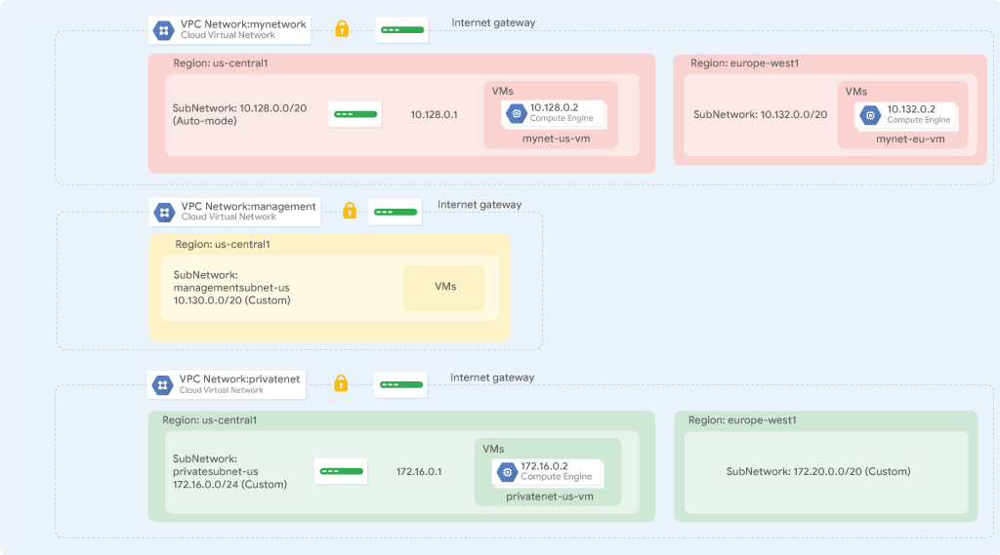

# VPC Networking



### 1. Create VPC Using Cloud Console

1. In the Cloud Console, on the Navigation menu (Navigation menu icon), click VPC network > VPC networks.

2. Click Create VPC Network.

3. For Name, type managementnet

4. For Subnet creation mode, click Custom.

5. Specify the following, and leave the remaining settings as their defaults:

| Property   | Value               |
| ---------- | ------------------- |
| Name       | managementsubnet-us |
| Region     | name_region         |
| IPv4 range | 10.240.0.0/20       |

6. Click Done.

7. Click Create.

### 2. Create VPC Using Cloud Shell

1. In the Cloud Console, click Activate Cloud Shell.

2. If prompted, click Continue.

3. To create the privatenet network, run the following command. Click Authorize if prompted.

```bash
gcloud compute networks create privatenet --subnet-mode=custom
```

4. To create the privatesubnet-us subnet, run the following command:

```bash
gcloud compute networks subnets create privatesubnet-us --network=privatenet --region=Region 1 --range=172.16.0.0/24
```

5. To create the privatesubnet-notus subnet, run the following command:

```bash
gcloud compute networks subnets create privatesubnet-notus --network=privatenet --region=Region 2 --range=172.20.0.0/20
```

6. To list the available VPC networks, run the following command:

```bash
gcloud compute networks list
```

7. To list the available VPC subnets (sorted by VPC network), run the following command:

```bash
gcloud compute networks subnets list --sort-by=NETWORK
```

### 3. Create the firewall rules using Console

1. In the Cloud Console, on the Navigation menu (Navigation menu icon), click VPC network > Firewall.

2. Click Create Firewall Rule.

3. Specify the following, and leave the remaining settings as their defaults:

| Property            | Value                            |
| ------------------- | -------------------------------- |
| Name                | managementnet-allow-icmp-ssh-rdp |
| Network             | managementnet                    |
| Targets             | All instances in the network     |
| Source filter       | IPv4 Ranges                      |
| Source IPv4 ranges  | 0.0.0.0/0                        |
| Protocols and ports | Specified protocols and ports    |

4. Select tcp and specify ports 22 and 3389.

5. Select Other protocols and specify icmp protocol.

6. Click Create.

### 4. Create the firewall rules Cloud Shell

1. Return to Cloud Shell. If necessary, click Activate Cloud Shell.

2. To create the privatenet-allow-icmp-ssh-rdp firewall rule, run the following command:

```bash
gcloud compute firewall-rules create privatenet-allow-icmp-ssh-rdp --direction=INGRESS --priority=1000 --network=privatenet --action=ALLOW --rules=icmp,tcp:22,tcp:3389 --source-ranges=0.0.0.0/0
```

3. To list all the firewall rules (sorted by VPC network), run the following command:

```bash
gcloud compute firewall-rules list --sort-by=NETWORK
```

### 5. Create instance using console

1. In the Cloud Console, on the Navigation menu (Navigation menu icon), click Compute Engine > VM instances.

2. Click Create instance.

3. Specify the following, and leave the remaining settings as their defaults:

| Property     | Value                                  |
| ------------ | -------------------------------------- |
| Name         | managementnet-us-vm                    |
| Region       | region_name                            |
| Zone         | zone_name                              |
| Series       | E2                                     |
| Machine type | e2-micro (2 vCPU, 1 core, 1 GB memory) |
| Boot disk    | Debian GNU/Linux 12 (bookworm)         |

4. Click Advanced options.

5. Click Networking.

6. For Network interfaces, click the dropdown arrow to edit.

7. Specify the following, and leave the remaining settings as their defaults:

| Property   | Value                |
| ---------- | -------------------- |
| Network    | managementnet        |
| Subnetwork | managementsubnet-usm |

8. Click Done.

9. Click Create.

### 6. Create instance using Cloud Shell

1. Return to Cloud Shell. If necessary, click Activate Cloud Shell.

2. To create the privatenet-us-vm instance, run the following command:

```bash
gcloud compute instances create privatenet-us-vm --zone=Zone 1 --machine-type=e2-micro --subnet=privatesubnet-us --image-family=debian-12 --image-project=debian-cloud --boot-disk-size=10GB --boot-disk-type=pd-standard --boot-disk-device-name=privatenet-us-vm
```

3. To list all the VM instances (sorted by zone), run the following command:

```bash
gcloud compute instances list --sort-by=ZONE
```

### 7. Test Ping

1. In the Cloud Console, on the Navigation menu, click Compute Engine > VM instances.

2. Click SSH to launch a terminal and connect.

3. To test connectivity to vm's external IP, run the following command, replacing vm's external IP:

```bash
ping -c 3 <Enter vm's external IP here>
```
